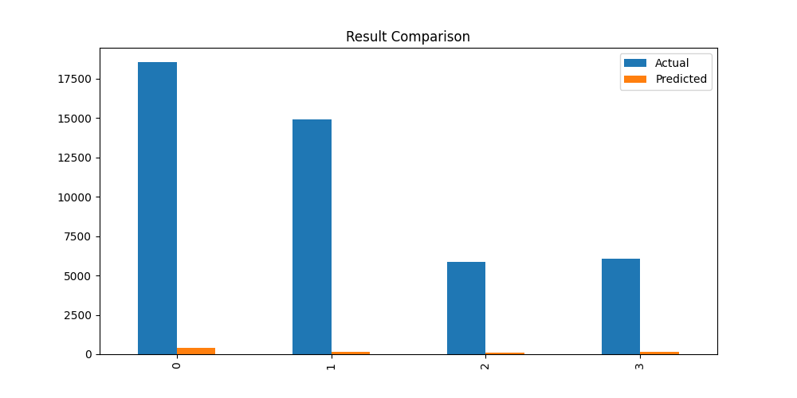

📚 District Education Performance Prediction using Hybrid Metaheuristic Models
📌 Project Overview

This project predicts district-level education performance using machine learning models optimized with hybrid metaheuristic algorithms.

The objective is to analyze education datasets and predict exam performance indicators such as pass percentage while comparing different optimization techniques.

The project combines Artificial Intelligence and Swarm Intelligence algorithms to improve model performance.

🎯 Objectives

The main objectives of this project are:

Predict district education performance using machine learning

Optimize neural network parameters using hybrid algorithms

Compare performance of multiple hybrid optimization models

Visualize results using graphs and heatmaps

Generate prediction outputs for further analysis

📂 Dataset

Dataset used:

EducationDataset_2023-24.csv

The dataset contains district-level education statistics such as:

Number of schools

Student enrollment

Exam participation

Pass percentages

Other education indicators

The dataset is located in:

C:\Users\NXTWAVE\Downloads\District Education Performance Prediction\
🧠 Hybrid Algorithms Implemented

The project implements several hybrid metaheuristic optimization techniques to optimize neural network parameters.

Prefix	Hybrid Model	Description
cis_	AIS + CSA	Artificial Immune System + Crow Search Algorithm
pis_	AIS + PSO	Artificial Immune System + Particle Swarm Optimization
bis_	AIS + BA	Artificial Immune System + Bat Algorithm
psa_	CSA + PSO	Crow Search Algorithm + Particle Swarm Optimization

These algorithms optimize ANN hyperparameters such as:

Number of neurons

Network structure

Model convergence

⚙️ Technologies Used

The project uses the following technologies:

Programming Language

Python

Machine Learning

TensorFlow / Keras

Scikit-learn

Data Processing

Pandas

NumPy

Visualization

Matplotlib

Seaborn

File Storage

JSON

YAML

CSV

HDF5

📦 Required Libraries

Install dependencies using:

pip install pandas numpy scikit-learn tensorflow matplotlib seaborn pyyaml joblib
🏗 Project Workflow

The project pipeline follows these steps:

1️⃣ Data Loading

The dataset is loaded from CSV format.

2️⃣ Data Cleaning

Remove missing values

Select numerical columns

Identify target variable

3️⃣ Data Preprocessing

Feature scaling using StandardScaler

Train-test split

4️⃣ Hybrid Optimization

Metaheuristic algorithms optimize neural network parameters.

5️⃣ Model Training

Artificial Neural Network is trained using optimized parameters.

6️⃣ Prediction

The trained model predicts district education performance.

7️⃣ Evaluation

Model performance is evaluated using:

RMSE

R² Score

8️⃣ Visualization

Graphs are generated to visualize:

Training accuracy

Prediction comparison

Correlation heatmap

📊 Generated Outputs

Each hybrid model generates the following outputs.

📁 Model Files
model.h5
pipeline.pkl
config.yaml
metadata.json

These files store the trained model and configuration.

📈 Visualization Graphs

The project generates and saves several graphs:

Accuracy Graph

Shows training and validation loss over epochs.

accuracy_graph.png
Correlation Heatmap

Displays relationships between dataset features.

heatmap.png
Prediction Graph

Compares predicted values with actual values.

prediction_graph.png
Comparison Graph

Shows prediction comparison between actual and predicted values.

comparison_graph.png
Result Graph

Displays prediction results for sample observations.

result_graph.png
📄 Generated Result Files

Each model produces the following result files.

Prediction JSON
predictions.json

Contains predicted and actual values.

Example:

{
 "actual": 78.2,
 "predicted": 76.5
}
Result CSV
results.csv

Contains tabular prediction results.

Actual	Predicted
78.2	76.5
81.4	80.1
📂 Project Folder Structure
District Education Performance Prediction
│
├── EducationDataset_2023-24.csv
│
├── cis_ais_csa_model.py
├── pis_ais_pso_model.py
├── bis_ais_ba_model.py
├── psa_csa_pso_model.py
│
├── cis_model.h5
├── pis_model.h5
├── bis_model.h5
├── psa_model.h5
│
├── cis_pipeline.pkl
├── pis_pipeline.pkl
├── bis_pipeline.pkl
├── psa_pipeline.pkl
│
├── cis_results.csv
├── pis_results.csv
├── bis_results.csv
├── psa_results.csv
│
├── cis_predictions.json
├── pis_predictions.json
├── bis_predictions.json
├── psa_predictions.json
│
├── cis_accuracy_graph.png
├── pis_accuracy_graph.png
├── bis_accuracy_graph.png
├── psa_accuracy_graph.png
│
└── README.md
🚀 How to Run the Project

Step 1 — Place dataset in project folder.

Step 2 — Run any hybrid model script:

Example:

python cis_ais_csa_education_model.py

Or

python pis_ais_pso_education_model.py
📊 Evaluation Metrics

The model performance is measured using:

Root Mean Square Error (RMSE)

Measures prediction error.

R² Score

Measures how well predictions match actual values.

Higher R² indicates better model performance.

📈 Applications

This project can be applied in:

Education analytics

Government education planning

District performance monitoring

School infrastructure optimization

Education policy analysis

🔮 Future Improvements

Possible improvements include:

Adding more hybrid algorithms

Using Deep Neural Networks

Implementing AutoML optimization

Building a Streamlit dashboard

Integrating real-time education datasets

👨‍💻 Author
Sagnik Patra
